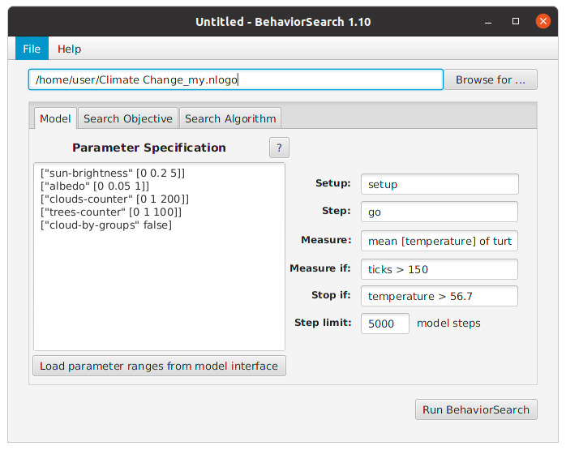
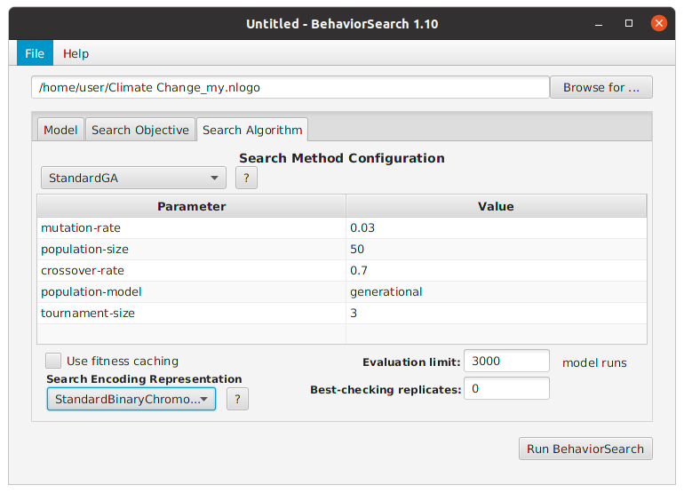

## Комп'ютерні системи імітаційного моделювання
## СПм-22-5, **Біліченко Олександр Олександрович**
### Лабораторна робота №**3**. Використання засобів обчислювального интелекту для оптимізації імітаційних моделей

 

### Варіант 2, модель у середовищі NetLogo:
[Climate Change](http://www.netlogoweb.org/launch#http://www.netlogoweb.org/assets/modelslib/Sample%20Models/Earth%20Science/Climate%20Change.nlogo)

 

#### Вербальний опис моделі:
З описом моделі можна ознайомитись за [посиланням](https://github.com/BillyAleks/Simulation_SPm22-5_L1?tab=readme-ov-file#%D0%B2%D0%B5%D1%80%D0%B1%D0%B0%D0%BB%D1%8C%D0%BD%D0%B8%D0%B9-%D0%BE%D0%BF%D0%B8%D1%81-%D0%BC%D0%BE%D0%B4%D0%B5%D0%BB%D1%96)
Модель є ускладненою з додаванням часу доби, та додаткових агентів (дерев), які впливають на зменшення заданого рівня показника CO2 на протязі симуляції.

#### Керуючі параметри:
- **sun-brightness** визначає кількість агентів у середовищі моделювання. А саме, інтенсивність сонячного випромінювання.
- **albedo** визначає показник властивості відраження сонячного випромінювання від поверхні землі.
- **clouds-counter** визначає показник ступіня хмарності, додаючі до моделі хмару, або певну кількість хмар зі здатністю відбиття сонячного проміння.
- **CO2** визначає показник кількості вуглекислого газу у атмосфері, крок збільшення показника 25 молекул.смугу руху.
- **trees-counter** визначає показник кількості висаджених дерев на полі симуляції, від цього показника залежить швидкість розчинення CO2

#### Показники роботи модеі:
- поточна температура Землі, що відстежується.
- поточний рівень CO2, що відстежується
- кількість теплової енергії поглиненої поверхнею.

 

### Налаштування середовища BehaviorSearch:

**Обрана модель**:

[Climate Change Enhanced Model](./Climate%20Change%20model.nlogo)

**Параметри моделі** (вкладка Model):  
Параметри, та їх можливі діапазони були автоматично вилучені з моделі, з невеличкою модифікацією:

<pre>
["sun-brightness" [0 0.2 5]]
["albedo" [0 0.05 1]]
["clouds-counter" [0 1 200]]
["trees-counter" [0 1 100]]
["cloud-by-groups" false]
</pre>

Такий параметр як **cloud-by-groups** був намірено переведений у константне значення, оскільки одиночне додавання хмар до симуляції є більш контрольованим, за групове. Це може покращити результати пошуку.
Початкова кількість варіацій по параметрам складає:     
**26х21х200х100 = 10920000**

Використовувана **міра**:  
Аналізуючи показники моделі, які було б доцільно відстежувати, має сенс використовувати Behavioral Search для знаходження **значення максимальної температури у симуляції**. Графік, який використовується для хронологічного збору даних не містить якихось особливих формул для вирахування значення температури:
  
тому внесемо мануально наступне значення до параметру "**Measure**":
<pre>
max [ temperature ] of turtles
</pre>
Відстежування самого по собі показника температури в цілому не зможе дати дінамічної картинки, тому у Search Objective ми будемо виористовувати усерднювальний спосіб обліку. 
Параметр "**Mesure if**", потенціально може бути змінений оскільки в нас на початку симуляції температура тримається на єдиному рівні (12 градусів  Цельсія), Має минути деякий час поки сонячні промені доберуться до координат поверхні планети, що запустить процес нагрівння. Було виявлено, що в середньому на це потребується близько 150 тактів симуляції. Тому в поле "**Mesure if**" вносимо наступний код:     
<pre>
ticks > 150
</pre>
Параметри "**Setup**" та "**Go**" вказують відповідні процедури ініціалізації та запуску в логіці моделі.
Параметр зупинки за умовою ("**Stop if**") виставимо значення абсолютного рекорду планети по температурі, який дорівнює 56.7:
<pre>
temperature > 56.7
</pre>
Оскільки в ускладненій моделі набір температури це довгий процес - ми виставимо ліміт у 5000 кроків.
Загальний вигляд вкладки налаштувань параметрів моделі:  

**Налаштування цільової функції** (вкладка Search Objective):  
Метою підбору параметрів імітаційної моделі, що описує поведінку трансформації сонячної енергії у теплову, є **максимізація** значення середньої температури – це вказано через параметр "**Goal**" зі значенням **Maximize Fitness**. Тобто, є необхідним визначити такі параметри налаштувань моделі, у яких сонячна енергія максимально трансформується у тепло. При цьому важливо, щоб температура не перевищила адекватний рівень. У параметрі "**Collected measure**", що визначає спосіб обліку значень обраного показника, вказажемо **MEAN_ACROSS_STEPS**, оскільки температура має властивість змінюватись на протязі доби - було б доцільно орієнтуватись саме на середній показник температури впродовж усієї симуляції.д
Щоб уникнути викривлення результатів через випадкові значення (здебільшого це положення тих чи інших агентів на полі симуляції), **кожна симуляція повторюється по 10 разів**, результуюче значення розраховується як **середнє арифметичне**.
Загальний вигляд вкладки налаштувань цільової функції:  

**Налаштування алгоритму пошуку** (вкладка Search Algorithm):  
*На цьому етапі було визначено модель, налаштовано її параметри і обрано міру, що лежить в основі функції пристосованості, що дозволяє оцінити якість кожного варіанту рішення, перевіряємого BehaviorSearch.  
У ході дослідження використовуються два алгоритми: Випадковий пошук(**RandomSearch**) і Простий генетичний алгоритм (**StandardGA**).  
Вони використовуються для вирішення завдання пошуку такого набору параметрів імітаційної моделі, при яких середня температура атмосфери в нашій симуляції, буде максимальною відносно результатів, отриманих з іншими наборами.
Для цього встановимо:
- "**Evaluation limit**" - 3000, оскільки процес набору тепла є плавним та повільним, для більшої точності будемо використати більшу кількість поколінь;
- "**Search Space Encoding Representation**" використаємо класичне кодування StandardBinaryChromosome. Згідно опису в [документації](https://www.behaviorsearch.org/documentation/tutorial.html), цей метод кодування виглядає найбільш збалансованим. Потенційно цікаво було б провести експерименти з використанням різних алгоритмів, для відстеження впливу кожного зних на показники результатів
Параметр "**Use fitness caching**". - Оскількі модель, яка розглядається є високоваріативною - свідомо вимкнемо цей флаг.
Параметри, специфічні для генетичного алгоритму використаємо за замовчанням.
Загальний вид вкладки налаштувань алгоритму пошуку:  

 

### Результати використання BehaviorSearch:
Діалогове вікно запуску пошуку:  

Результат пошуку параметрів імітаційної моделі, використовуючи **генетичний алгоритм**:  

Результат пошуку параметрів імітаційної моделі, використовуючи **випадковий пошук**:  

Очікувано, що процес пошуку при таких вхідних параметрах був надзвичайно довгим.
В даному випадку генетичний алгоритм був більш точним. При однакових вхідних даних різниця між прогонами майже вдівічі відрізняється. Цілком можливо, що причиною цього є більш вдале позиційне розташування агентів на площині симуляції. Однак є дивним, що більш низький показник кількості хмар/альбедо не виявився кращим за результуючий.

Для перевірки запропоновані вхідні дані були випробувані на моделі у середовищі NetLogo.     
Кількість тактів взята аналогічною до кількості тактів в параметрах Behavior Search (5000)     
На п'яти прогонах вираховуємо середню температуру.

<table>
<thead>
<tr><th>Номер прогону</th><th>Середня температура</th></tr>
</thead>
<tbody>
<tr><td>1</td><td>30.43</td></tr>
<tr><td>2</td><td>31.71</td></tr>
<tr><td>3</td><td>32.2</td></tr>
<tr><td>4</td><td>31.51</td></tr>
<tr><td>5</td><td>32.99</td></tr>
</tbody>
</table>

Це дослідження показало, що результати генетичного алгоритму були не випадковістю. Кожен окремий прогон - показник середньої температури був вищим ніж запропонований алгоритмом Random_Search. З цього можна зробити твердження, що відносно досліджуємої моделі такий алгоритм пошуку як Random_Search, не є ефективним.